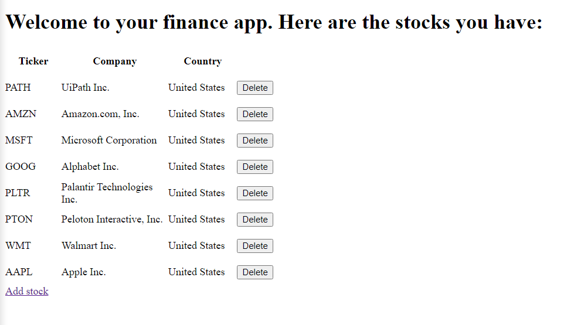

 # MyFinance API

A python app that allows you to access financial data such as stock prices, corporate data, 
charts and so forth, using Yahoo Finance API. 

## Instalation

Git clone:
1. https://github.com/sergius888/myfinanceAPI.git
2. pip3 install -r requirements.txt

3. Create virtual environment

## Usage

1. Start the server using Uvicorn:

uvicorn my_finance.index:app --reload --port 7777 
(make sure you execute the command from Project_1 directory)
2. Access http://127.0.0.1:7777/docs
3. Use POST to access data for any stock by typing its ticker code (ex. Apple = AAPL), which will be saved in a database and it can be accessed anytime using the GET function.
4. Use the other commands for the rest of the features.
5. To access the web framework, execute the command (flask run -p 7777) from your terminal, from Project_1 directory.
6. Access http://127.0.0.1:7777/

7. Use "Add stock" and type the ticker code for the stock you are looking for, use delete to remove.
